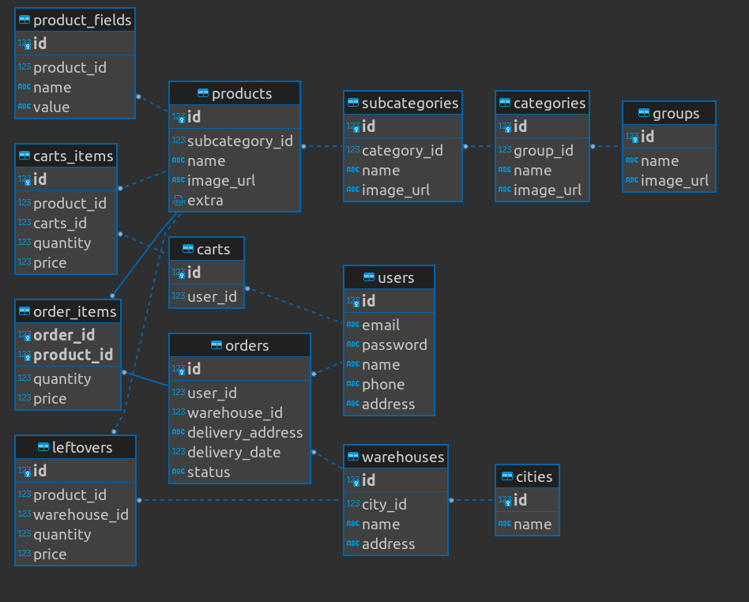
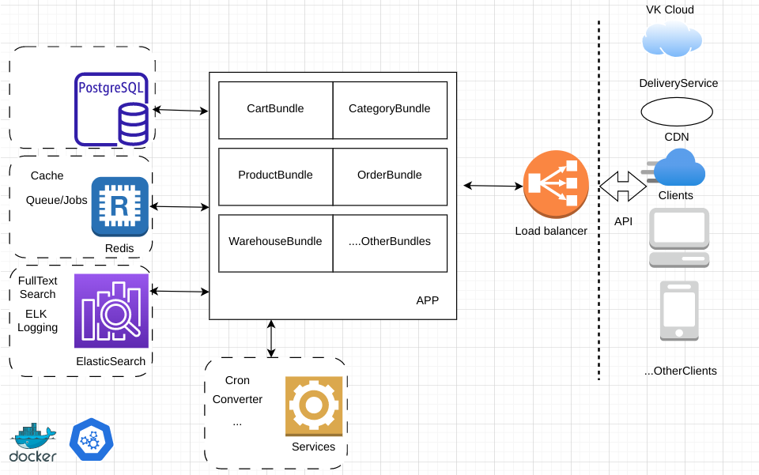

## Интернет магазин
## I База данных
1. Выбор БД  
Основная БД - postgres.  
Кеш БД - redis.  
Код БД в файле - script.sql  
Диаграмма данных (файл images/BDDiagram.png):  
  
2. Медиаконтент.  
Работу с медиаконтентом предлагаю делегировать объектному хранилищу с поддержкой S3 (VK Cloud Storage). 
3. Обоснование. 
- Интернет магазины имеют сложную логику фильтрации и сортировки не только по одной сущности, но и между сущностями, поэтому в качестве основной бд выбрана реляционная бд (postgre). Реляционные базы данных позволяют создавать связанные таблицы, что позволяет лучше организовывать данные, предоставляют высокую доступность и масштабируемость для 
управления большими объемами связанных данных. Для оптимизации скорости отклика к критически важным страницам (например, каталог товаров, главная страница и иные нагруженные страницы) и для организации очередей используем Redis. Nosql базы данных более эффективны для работы где необходима гибкая архитектура, которая позволяет эффективно управлять большими объемами данных и часто изменяемыми данными,так же имеют лучшую доступность, но они не предоставляют такой же уровень структурированности и отслеживания данных как реляционные. 
- Специализированные объектные хранилища имеют ряд преимуществ, некоторые из них:  
Высокая масштабируемость. Позволяют быстро увеличивать и уменьшать объем хранимых данных, что позволяет адаптироваться к росту и снижению требований к хранилищу  
Высокий уровень доступности.  
Экономия серверных ресурсов.  
Увеличивают скорость загрузки контента(в некоторых случаях) 
Удобный интерфейс и широкий функционал 
Недостатки:  
Высокие затраты на хранение данных. Хотя существуют разные тарифы, но, имеются дополнительные расходы, такие как расходы на передачу данных, использование API-интерфейсов и т.д. 
Недостаточный уровень безопасности. Требования безопасности могут не соответствовать требованиям организаций. 
Ограниченные типы файлов. 
Нестабильные соединения. 
## II Схема системы
Схема (файл images/schema.png):  
  
